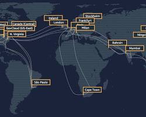
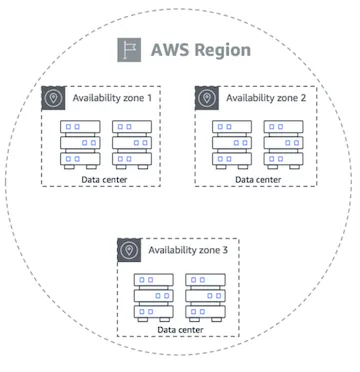
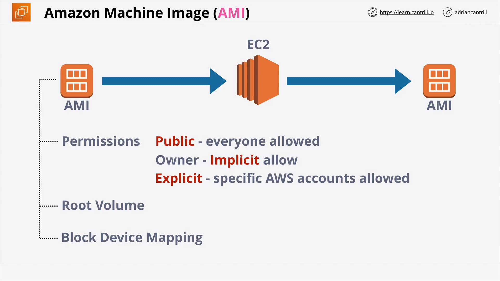
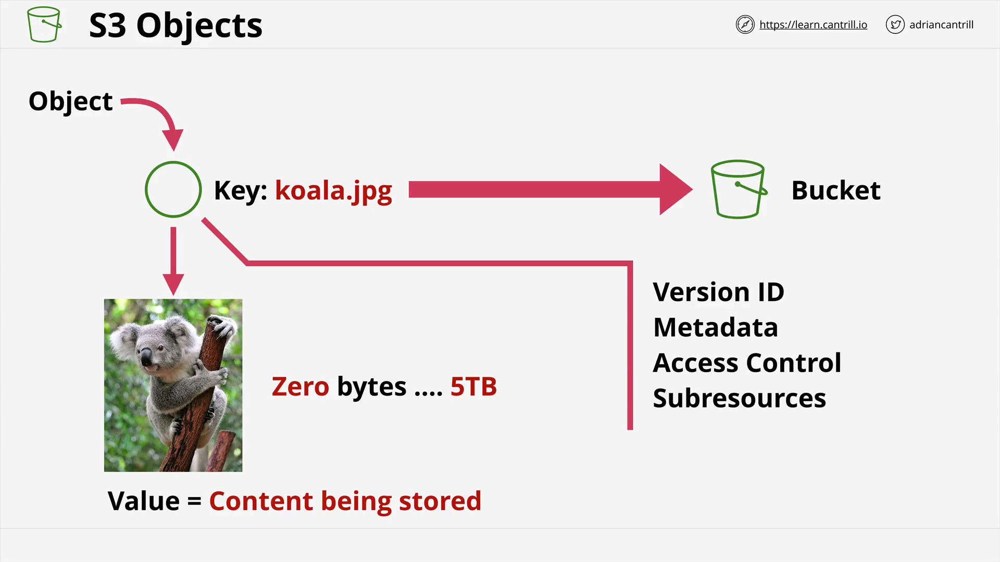
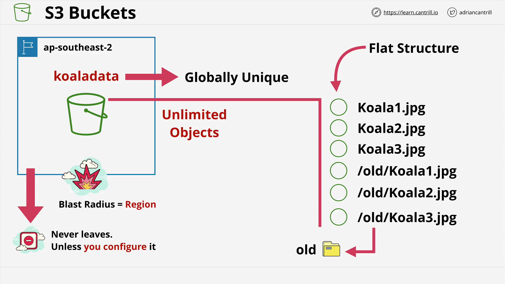
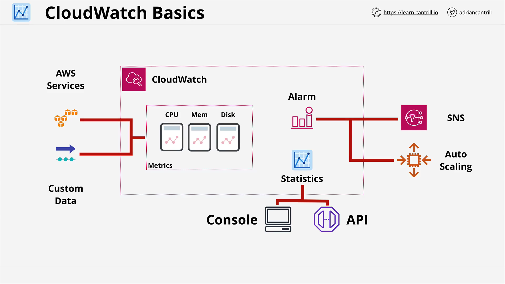
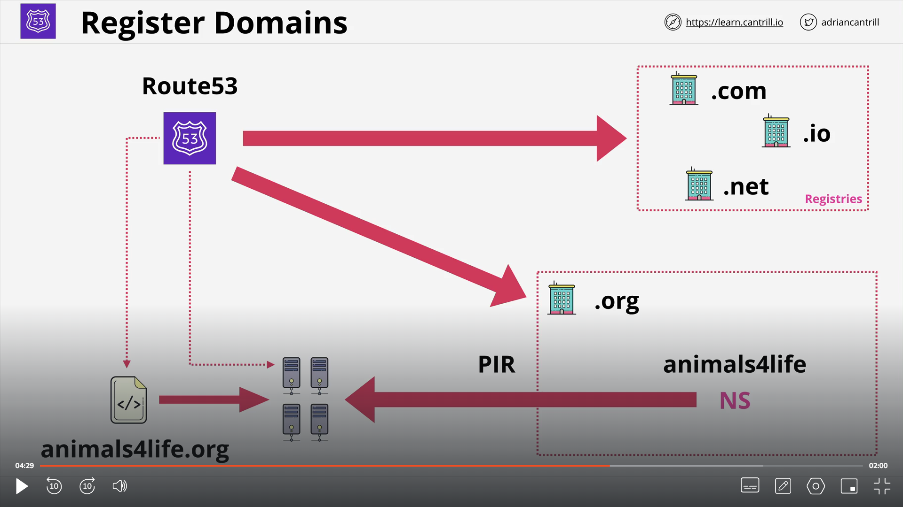

# AWS Public Internet Zone | AWS Public Zone (Amazon Route 53) | AWS Private Zone (Amazon Route 53):

](Images/Public_Vs_Private.png)

Public Internet Zone:
•	The global, hierarchical naming system that translates domain names (e.g., "example.com") into IP addresses (e.g., "192.168.1.1").
•	Managed by multiple organizations, including ICANN (Internet Corporation for Assigned Names and Numbers) and regional registries.
•	Accessible to anyone on the internet.

AWS Public Zone (Amazon Route 53):
•	A service within AWS that allows you to manage your public DNS records.
•	Enables you to point your domain name (registered elsewhere) to resources, such as:
o	Websites hosted on AWS services (e.g., Amazon S3) or external providers.
o	Load balancers or other infrastructure elements.
•	Publicly accessible to anyone querying your domain name.

AWS Private Zone (Amazon Route 53):
•	A service within AWS that allows you to manage your private DNS records.
•	Used to map internal domain names to resources within your AWS Virtual Private Cloud (VPC).
•	Not accessible from the public internet, providing an extra layer of security for private resources.

# AWS GLOBAL INFRASTRUCTURE
Amazon Web Services (AWS) Global Infrastructure is a network of data centers and other facilities spread across the globe. It provides a secure and reliable platform for running cloud applications and storing data.

Here are the key components of AWS Global Infrastructure:

# Region:

Regions: A region is a geographical area where AWS has multiple Availability Zones. There are currently 26 regions around the world, with more planned for the future.

- Geographic Seperation : 
--Isolated Fault Domain
--Used to provide geographic separation and improve resilience across regions.

-Geopolitical Seperation :
--Different governance.
--May have different laws, regulations, and compliance requirements.
--Physically isolated from each other.

Location Control :
-- Allows you to specify which region(s) a resource should be deployed in.
examples: "us-east-1", "eu-west-2"

# Availability Zones:
Availability Zones (AZs): An Availability Zone is a physically separate data center with its own power, cooling, and networking infrastructure. This redundancy helps to ensure that your applications are highly available and fault-tolerant. Each region has at least two Availability Zones.

-- Physically separate data centres with independent power, cooling, and networking.

# Edge Location:
Edge locations in AWS are data centers specifically designed to deliver content faster to users by bringing it closer geographically. They act as caching points for various AWS services, such as:

CloudFront: A content delivery network (CDN) service that uses edge locations to cache static content (e.g., images, videos, JavaScript) closer to end users, reducing latency and improving performance.
AWS Shield: A security service that mitigates distributed denial-of-service (DDoS) attacks by filtering traffic at the edge of the AWS network, preventing malicious traffic from reaching your resources.

# SERVICE RESILIENCE

--->Globally Resilient:
In the event of an Availability Zone (AZ) failure, traffic seamlessly fails over to an alternate AZ, ensuring continuous service availability on a global scale.

--->Region Resilient:
In the scenario where two AZs become unavailable, traffic is automatically redirected to a third AZ, maintaining service continuity at the regional level.
No Single Point of Failure within a Region or Globally:
The architecture is designed to eliminate any single points of failure, both at the regional and global levels, ensuring robustness and uninterrupted service delivery.

--->AZ Resilient:
Even in the rare occurrence of three AZs facing issues, a certain level of accessibility persists, demonstrating resilience in the face of localized failures.

# Virtual Private Cloud: (Region Specific)

--> Two Types :

---> Default VPC :
--A default VPC is created once per region when an AWS account is first created.
--There can only be one default VPC per region, and they can be deleted and recreated from the console UI .
--> Default VPC CIDR is always 172.31.0.0/16
--Single Availability Zone: The default VPC is created in a single Availability Zone (AZ). If that AZ experiences an outage, all resources within the VPC will be affected, leading to downtime.
--Limited Security: It comes with a predefined security group that allows all inbound traffic, increasing the vulnerability of your resources.
-- In default VPC /20 Subnet in each AZ available in that region will be assigned by default.
--Subnet assign public IPv4 addresses.

--Internet Gateway : Provides internet access to resources within your VPC and vice versa.
--Security Group  : Controls network traffic for EC2 instances ,elb etc. (Instance Level)
--NACL :  Network Access Control List controls network traffic at the subnet level. (Subnet Level)

--->Custom VPC -- They obtain reselience by having at least distributed across two Availability zones.
--There can be multiple number of custom VPCs under  a single AWS Account.
--They are private and isolated unless you decide otherwise .

# Elastic Cloud Compute (EC2):

->The Elastic Compute Cloud or EC2 is AWS's implement of IAAS - "Infrastructure as a service".
->It allows you to provision "virtual machines" known as "instances" with resources you select and an operating system of your choosing.
->Its a private service by-default which means it uses VPC networking.
->AZ Resilient - Instance fails if AZ fails.
->Different instance sizes and capabilities.
->Customer need to configure the guest OS.
->On demand Billing -> Per Second.
-> Even when you stop and instance the charges are be  applied until the instance is been terminated.
-> Connect EC2 instance to window's OS using RDP (Remote Desktop Protocol) [Port 3389]
-> Connect EC2 instance to Linux OS using SSH[Key - Pair] (Secure Socket Shell )

-> Instace Lifecycle

-->    Running <-> Stopped - > Terminated
        |                          ^
        |__________________________|

# Amazon Machine Image (AMI):

->Permissions : Public - everyone allowed.
                Owner - Implict allow.
                Explict - specific AWS accounts are allowed.
                Private - Only owner is allowed.

-->An AMI is a virtual machine image that provides the information required to launch an instance. It includes the following:
    ->Operating system
    ->Applications
    ->System configuration

--> Root Volume:
The primary storage device attached to an EC2 instance.
It holds the operating system, applications, and data for the instance.
When you launch an instance from an AMI, the root volume's configuration (size, type) is copied to the new instance.

--> Block Device Mapping:
A mechanism in an AMI that defines how block devices (storage devices) will be attached to an instance when launched.
It specifies:
Device name: The name assigned to the device within the instance (e.g., /dev/sda).
Virtualization type: Whether the instance is paravirtual (PV) or hardware virtual machine (HVM), which determines the available device names.
Volume type: The type of EBS volume (e.g., gp2, io1) or instance store volume to be attached.
Snapshot ID (optional): If specified, the volume will be created from an existing EBS snapshot, ensuring identical data for new instances launched from the AMI.

->AMIs are stored in Amazon S3 and can be shared with other AWS accounts.

# Amazon S3(Simple Storage Service): (Public Service, Unlimited data & multi-user)

->Amazon Simple Storage Service (Amazon S3) is a highly scalable and object-based storage service offered by Amazon Web Services (AWS). It provides a cost-effective and reliable way to store and retrieve any amount of data, from a few kilobytes to petabytes, in the cloud.
-->Amazon S3 is a global service, but data is regional.
-->Data is automatically replicated across multiple Availability Zones in an AWS Region.
-->economical & accessd via UI/CLI/API/HTTP.

->Objects: Unlike traditional file systems, S3 stores data as objects, which consist of data, metadata (descriptive information), and an optional access control list (ACL) that determines who can access the object. This structure offers flexibility and scalability for various data types.

->Buckets: A container for storing  objects.
-->Buckets are private by default but can be made public.
-->Bucket names must be unique across all existing bucket names in AWS.
-->Bucket names are globally unique.
-->3 - 63 characters, all lower case, no underscores.
-->starts with a lowercase letter or a nummber.
-->cant be IP formatted eg: 1.1.1.1
--> Unlimited objects in the bucket, 0 bytes to 5TB.
-->Key = Name, Value = Data.

-->>Note:
->S3 is an object store- not file or block.
->You can't mount an S3 bucket as(K:\ or /images).
->Great for large scale data storage, distribution or upload.
->Great for 'offload'.

# Cloud Formation:

->CloudFormation is an Infrastructure as Code (IaC) product in AWS which allows automation infrastructure creation, update and deletion.
->Templates created in YAML or JSON can be used to automate infrastructure operations
->Templates are used to create stacks, which are used to interact with resources in an AWS account.

# Cloud Watch
->CloudWatch is a core supporting service within AWS which provides metric, log and event management services.
->It's used through other AWS services for health and performance monitoring, log management and nerveless architectures.

->3 main Types:

1. Cloud Watch  Metrics: Provides metrics from AWS Products, Apps and on-premises.
-->Collection of releated Data points in a "Time ordered structure".
2. Cloud Watch Logs: Aws products, Apps and on-premises.
3. cloud watch Events: Aws Services &Svhedules.

Demo Steps
Create an EC2 instance
t2.micro
ensure its set to the default VPC and has a public IP
Optionally enable detailed monitoring
Connect to the instance and install Extras package and stress
Install stress (commands listed in code sample below)
Create an alarm based on the CPU Utilisation of the created instance
Threshold greater than 15%
Run stress 'stress -c 2'
Wait for alarm to .. alarm
use ctrl + c to cancel stress
Wait for alarm to return to ..ok
Delete the alarm
Delete the instance
TEXT
sudo yum install stress -y   [Used for deploying more stress/ workload on aws cpu]

# Shared Responsibility Model:

# High Availability | Fault Tolerant | Disaster Recovery 

High Availability:

Aims to ensures an agreed level of operational performance, usually uptime, for a higher than normal period.
->Its not about user disruption and how time you are using to relaunch it during disaster recovery but system availability.

# Fault Tolerant(FT):

IT is the property that enables a system to continue operating properly in the event of the faailure of some (one or more faults within) or its components.

# Disaster Recovery(DR):

A set of policies, tools and procedures to enablle the recovery or continuation of virtual technology infrastructure and systems following a natural or human induced disaster.

--> Summary:
High Availability: Mininmise any outages.
Fault Tolerance: Operate Through Faults.
Disaster Recovery: Used when these dont work.

# Route53 (Works through Failure) -> Global Service .... Single database

-> Register Domain
-> Hot Zones.. managed nameservers
-> Globally Resilient
 
->Hosted Zones:
-->In Amazon Route 53, a Hosted Zone is a fundamental building block. It essentially functions like a virtual container that holds all the DNS records for a specific domain and its subdomains.
--> When you create a hosted zone within route53, Route53 will allocate 4 name servers to host this hosted  zone. 
-->Public Hosted Zones: These zones manage DNS records for domains publicly accessible on the internet. You can register your own domain or use one from a supported TLD (Top-Level Domain) list offered by Route 53.
-->Private Hosted Zones: These zones manage DNS records for domains within your Amazon Virtual Private Cloud (VPC). They are not accessible from the public internet and are primarily used for internal resources within your VPC.

->DNS Record Types:

-->1. Nameserver (NS):  Name server records provide the domain name system with information about other name servers that can answer queries for your A , CNAME , MX ... etc
-->2. A and AAAA records:  IPv4 and IPv6 addresses.
--> 3. CNAME records: Canonical name record. Points to another domain name. 
--> 4. MX records: Mail exchange record. Specifies the mail server responsible for handling email sent to a domain.
--> 5. TXT  records: Text strings used by email systems or other applications to verify the owner's identity.
--> 6. TTL  Time To Live: The length of time that an individual DNS entry should be cached before it is refresh.

Note:
-->If you are doing any work that involves change in dns records its always recommended to lower the TTL value well in advance of the work, this makes sure that there are less caching issues.

